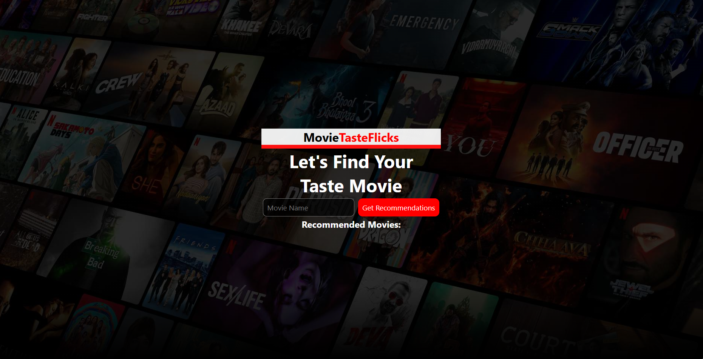
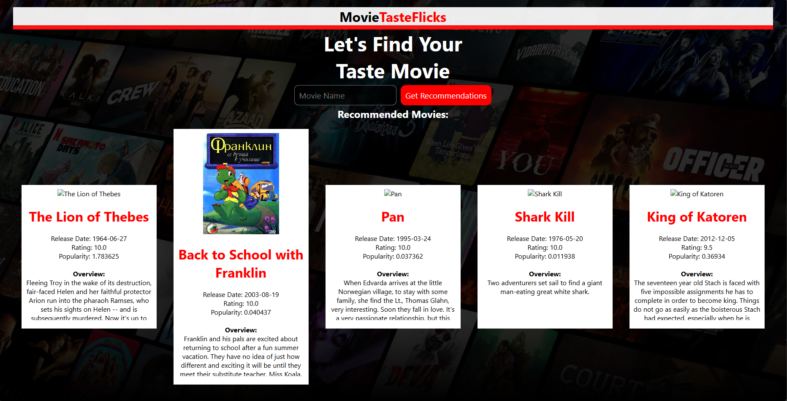

---
# 🎬 MovieTasteFlicks – Movie Recommendation System

**MovieTasteFlicks** is an interactive web app that recommends similar movies based on user input. It uses **KMeans Clustering** on a dataset of over 45,000 movies to suggest titles that match genre, popularity, and rating patterns.

> 💡 Built using **Flask**, **Pandas**, and **scikit-learn**, this app helps users find great movie suggestions in seconds!

---

---

## 📸 Preview

| Home Page | Recommendation Output |
|-----------|------------------------|
|  |  |

> 🗂️ **Note:** The `preview/` folder is only for screenshots. You may delete it before deploying.

---

## 🚀 Features

- 🎞️ Movie suggestions based on clustering
- 📊 Uses genre, vote average, and popularity as input features
- 📦 Cleaned and preprocessed TMDB dataset
- 🌐 Hosted for free on Render

---

## 🧠 How It Works

1. Loads and cleans a movie metadata dataset
2. Applies **one-hot encoding** on genres
3. Normalizes numerical columns
4. Clusters movies using **KMeans**
5. Recommends titles from the same cluster as the input movie

---

## 🧩 Core Model

This web app is powered by a standalone core machine learning model available here:  
🔗 [Movie Recommendation System – Core ML Project](https://github.com/arshc0der/Movie-Recommendation-System)

> The core repo contains data preprocessing, feature engineering, and clustering logic used in this web app.

---

## 🛠️ Tech Stack

- **Backend**: Flask
- **ML**: scikit-learn (KMeans)
- **Frontend**: HTML/CSS
- **Libraries**: pandas, numpy, seaborn, matplotlib
- **Hosting**: Render

---

## 💻 Run Locally

```bash
# Clone the repository
git clone https://github.com/arshc0der/MovieTasteFlicks-Movie-Recommendation-Flask.git
cd MovieTasteFlicks-Movie-Recommendation-Flask

# (Optional) Create a virtual environment
python -m venv venv
source venv/bin/activate  # On Windows: venv\Scripts\activate

# Install dependencies
pip install -r requirements.txt

# Run the app
python app.py
````

Then open your browser at: [http://localhost:5000](http://localhost:5000)

---

## 📂 Dataset Used

* File: `movies_metadata.csv`

---

## 🧹 Note for Deployment

Before deploying or sharing:

* ❌ **Delete the `preview/` folder** (optional visuals)
* ✅ Ensure your `requirements.txt` includes all dependencies

---

## 📄 License

MIT License – feel free to use, share, or improve!

---

### 🙌 Made with love by [@arshc0der](https://github.com/arshc0der)

```

---

